# 没错，我给androidx修了一个bug！

不容易啊，必须先截图留恋😁

|   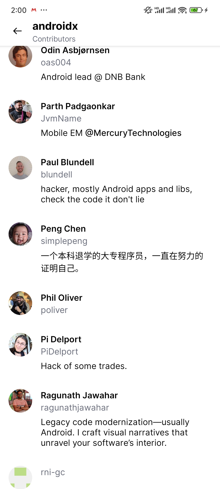   | 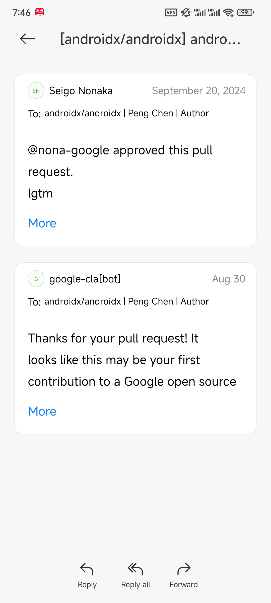 | 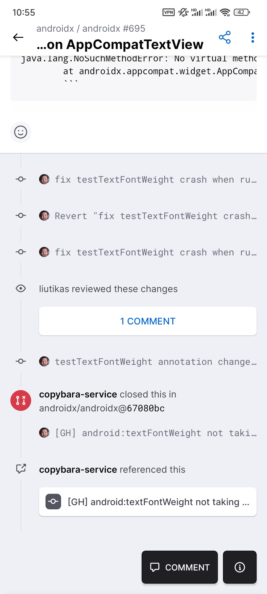 |
| ---- | ---- | ---- |

这个bug是发生在xml中给`AppcompatTextView`设置`textFontWeight`，但是却无法生效。修复bug的代码也很简单，总共就几行代码，但是在找引起这个bug的原因和后面给androidx提pr却花了很久。

```java
//AppcompatTextHelper  
if (Build.VERSION.SDK_INT >= Build.VERSION_CODES.P
          && mFontWeight != TEXT_FONT_WEIGHT_UNSPECIFIED && mFontTypeface != null) {
      mFontTypeface = Api28Impl.create(mFontTypeface, mFontWeight,
              (mStyle & Typeface.ITALIC) != 0);
```

事情的起因是这样的，在Android开发中，我们经常会遇到设计需要我们让TextView支持`medium`，`bold`等不同字重样式，原生TextView给了一个`textStyle`的属性，但是这个属性只支持`bold`，`italic`，`normal`三种样式，这肯定是满足不了设计小姐姐的需求的，而且很多时候`bold`的样式都比设计出的样式要粗一些。

以前的老办法就是导入不同字重样式的字体文件到app里面，但是很多字体包要支持的语言比较多的话，字体包文件又会比较大，会造成Apk包体积增大。裁剪字体包也可以，但是样式字体包文件多了，也是一件麻烦事，这些杂事很多又不会算到开发时间里面，我就想还有没有其他的解决办法。

网上搜索了下，大多数都是让使用`textFontWeight`属性的，这个属性倒是可以支持`0-1000`的字重设置，但是就是兼容性不好，只支持大于`api28`的手机使用。

> Attribute textFontWeight is only used in API level 28 and higher (current min is 21)

但是从我实际使用来看，好像这个属性在`TextView`上也并没起作用。

```xml
<TextView
    style="@style/TextStyle"
    android:layout_width="wrap_content"
    android:layout_height="wrap_content"
    android:text="Font100"
    android:textFontWeight="100" />
...
<TextView
    style="@style/TextStyle"
    android:layout_width="wrap_content"
    android:layout_height="wrap_content"
    android:text="Font100"
    android:textFontWeight="900" />
```
我用一个`LinearLayout`装了9个TextView，`textFontWeight`设置从`100-900`，然后运行在api34的模拟器上，可以看到每个TextView都没应用上`textFontWeight`属性。

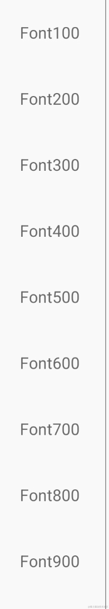

然后我就去`Read The Fucking Source Code`，看看`TextView`的`textFontWeiget`的相关源码。`TextView`设置`textFontWeiget`的相关源码就是从`setTypefaceFromAttrs`到`resolveStyleAndSetTypeface`，最后就是`setTypeface`。

```java
private void setTypefaceFromAttrs(@Nullable Typeface typeface, @Nullable String familyName,
        @XMLTypefaceAttr int typefaceIndex, @Typeface.Style int style,
        @IntRange(from = -1, to = FontStyle.FONT_WEIGHT_MAX) int weight) {
    if (typeface == null && familyName != null) {
        // Lookup normal Typeface from system font map.
        final Typeface normalTypeface = Typeface.create(familyName, Typeface.NORMAL);
        resolveStyleAndSetTypeface(normalTypeface, style, weight);
    } else if (typeface != null) {
        resolveStyleAndSetTypeface(typeface, style, weight);
    } else {  // both typeface and familyName is null.
        switch (typefaceIndex) {
            case SANS:
                resolveStyleAndSetTypeface(Typeface.SANS_SERIF, style, weight);
                break;
            case SERIF:
                resolveStyleAndSetTypeface(Typeface.SERIF, style, weight);
                break;
            case MONOSPACE:
                resolveStyleAndSetTypeface(Typeface.MONOSPACE, style, weight);
                break;
            case DEFAULT_TYPEFACE:
            default:
                resolveStyleAndSetTypeface(null, style, weight);
                break;
        }
    }
}
```

```Java
private void resolveStyleAndSetTypeface(@NonNull Typeface typeface, @Typeface.Style int style,
        @IntRange(from = -1, to = FontStyle.FONT_WEIGHT_MAX) int weight) {
    if (weight >= 0) {
        weight = Math.min(FontStyle.FONT_WEIGHT_MAX, weight);
        final boolean italic = (style & Typeface.ITALIC) != 0;
        setTypeface(Typeface.create(typeface, weight, italic));
    } else {
        setTypeface(typeface, style);
    }
}
```
从代码可以看出来，设置`textFontWeight`就是靠`Typeface.create(typeface, weight, italic)`。
这样来说，我们的代码应该是没有问题的呀，可是为啥没有起效呢？我想了很久，期间我想用hook的办法，把每个`TextView`的`textFontWeight`都打印出来看看，然后我就写了一个`WeightPrinterTextView`工具类。

```Kotlin
class WeightPrinterTextView @JvmOverloads constructor(
    context: Context,
    attrs: AttributeSet? = null
) : TextView(context, attrs) {
}
```
然后我把`xml`中的`TextView`都替换成这个`WeightPrinterTextView`，意想不到的是，`textFontWeight`这个属性竟然又起效果了😂。

```xml
<LinearLayout
    style="@style/WeightLL"
    android:layout_height="match_parent"
    android:orientation="vertical">

    <demo.simple.fontweighttextview.WeightPrinterTextView
        android:id="@+id/textView1"
        style="@style/TextStyle"
        android:layout_width="wrap_content"
        android:layout_height="wrap_content"
        android:text="Font100"
        android:textFontWeight="100" />

    <demo.simple.fontweighttextview.WeightPrinterTextView
        style="@style/TextStyle"
        android:layout_width="wrap_content"
        android:layout_height="wrap_content"
        android:text="Font200"
        android:textFontWeight="200" />
    
    ...

    <demo.simple.fontweighttextview.WeightPrinterTextView
        style="@style/TextStyle"
        android:layout_width="wrap_content"
        android:layout_height="wrap_content"
        android:text="Font800"
        android:textFontWeight="800" />

    <demo.simple.fontweighttextview.WeightPrinterTextView
        style="@style/TextStyle"
        android:layout_width="wrap_content"
        android:layout_height="wrap_content"
        android:text="Font900"
        android:textFontWeight="900" />
</LinearLayout>
```

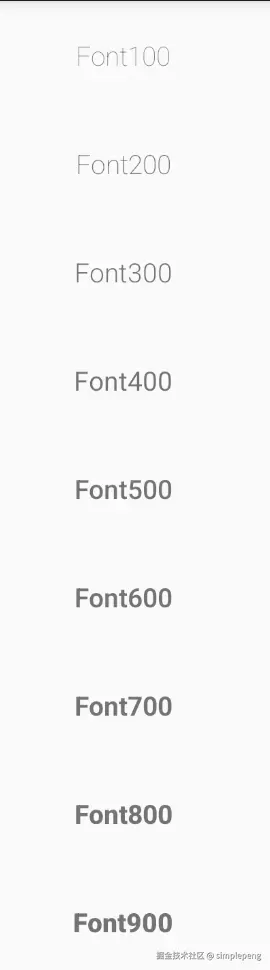

啊，这？又把我秀到了，不愧是Android啊！不信邪的我，还重写clean了项目，然后`xml`又换回了`TextView`，再运行，结论就是`TextView`就是不行，但是自定义继承`TextView`的`WeightPrinterTextView`就是可以，这就奇怪了。

一次偶然的断点调试让我发现了端倪，在xml中声明的`TextView`竟然变成了`AppcompatTextView`，我写了几个方法验证了下，发现了如下规律：在xml中定义的`TextView`会转换成`AppcompatTextView`，但是自定义继承的`TextView`是不会转换类型的。


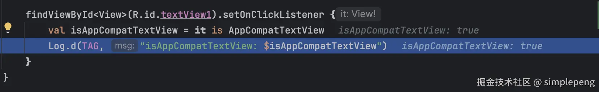

其实到这里，我大概就明白了应该是`AppcompatTextView`的问题，因为我之前也看过相关源码，知道如果`Activity`是继承自`AppcompatActivity`的，在`createView`的时候，会自动把相关的基础控件转成`Appcompat`的相关关联控件。

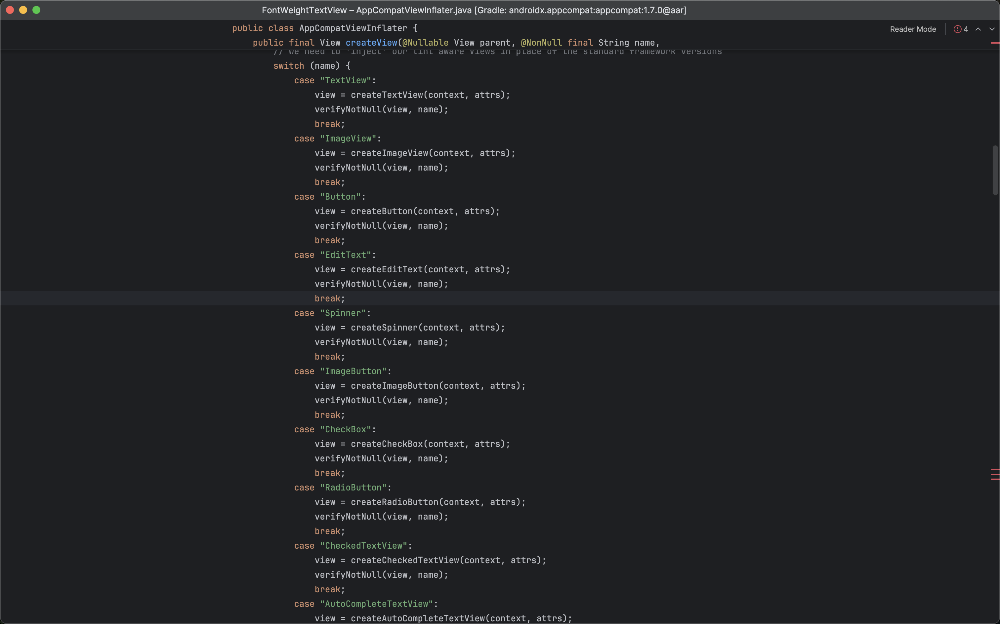

接下来又是喜闻乐见的`Read The Fucking Source Code`时间，首先肯定从`View`的`构造函数`看起，因为`View属性`一般都是在构造函数中读取的。

```java
public AppCompatTextView(
        @NonNull Context context, @Nullable AttributeSet attrs, int defStyleAttr) {
    super(TintContextWrapper.wrap(context), attrs, defStyleAttr);

    ThemeUtils.checkAppCompatTheme(this, getContext());

    mBackgroundTintHelper = new AppCompatBackgroundHelper(this);
    mBackgroundTintHelper.loadFromAttributes(attrs, defStyleAttr);

    mTextHelper = new AppCompatTextHelper(this);
    mTextHelper.loadFromAttributes(attrs, defStyleAttr);
    mTextHelper.applyCompoundDrawablesTints();

    mTextClassifierHelper = new AppCompatTextClassifierHelper(this);

    AppCompatEmojiTextHelper emojiTextViewHelper = getEmojiTextViewHelper();
    emojiTextViewHelper.loadFromAttributes(attrs, defStyleAttr);
}
```

从代码来看好像也只有`loadFromAttributes`方法关联性比较大，然后再进入这个方法里面，但是这里嵌套的方法就更多了，就不详细阐述了。如果光是看代码去找问题就可大海捞针了，这里推荐我最喜欢的`断点单步调试方法`，在你觉得有关系的相关代码上打上断点，然后等着代码执行，一步一步的看调试结果就行了。

但是有一个注意的点就是：你要选择和运行代码匹配的库版本才行，比如你导入了两个`appcompat`的库，断点打在了`1.0.0`版本的源码上，但是运行的却是`2.0.0`的库，或者就是断点打在了`Android14`的源码上，但是运行的手机或模拟器却是`Android13`的系统。

反正经过我的各种调试，各种跳转，最终定位到了`AppCompatTextHelper`的`updateTypefaceAndStyle`方法。大致解释下造成这个bug的原因：就是`updateTypefaceAndStyle`被调用了两次，第一次的`mFontWeight`值是对的，但是`mFontTypeface`却是`fontWeiget`不对的，所以第二次就设置成了错误的`FontTypeface`，所以我们只需要像下面的代码，重新创建一个新的`mFontTypeface`就好了。

```java
//AppcompatTextHelper  
if (Build.VERSION.SDK_INT >= Build.VERSION_CODES.P
          && mFontWeight != TEXT_FONT_WEIGHT_UNSPECIFIED && mFontTypeface != null) {
      mFontTypeface = Api28Impl.create(mFontTypeface, mFontWeight,
              (mStyle & Typeface.ITALIC) != 0);
```

本来到这里就应该结束了，我只需要用hook或者反射等相关方法解决掉自己的需求就好了，但是突然想到我好像从来没给Google的仓库提交过代码，之前也就给`AndroidUtilCode`，`ijkplayer`这种国内开发者的仓库提过pr，不管了，试试就逝世😂！

我去仔细读了`androidx`的`readme`文档，大致流程就是先在[Android Issue Tracker](https://issuetracker.google.com/issues/new?component=192731&template=842428)创建一个issue，这一点很坑，我从它这链接点进去，说我没有create issue的权限，我还以为不用完成这一步，这也导致了最开始这个pr搁置了很久也没人来code review。

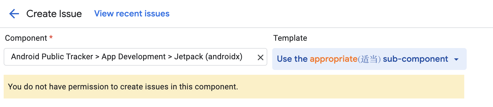

其实是需要在下拉框，重新选择子模块的。

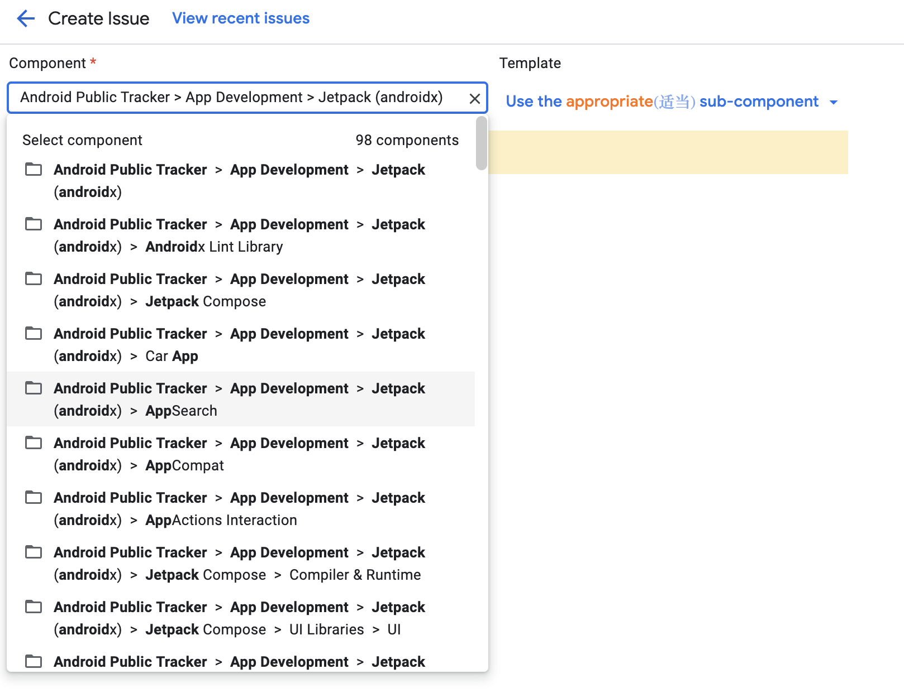

然后再是添加自己的Test方法，覆盖测试用例，完善文档说明，最后push代码，new一个新的pr，选择一个code reviewer。

```java
 @Test
 public void testTextFontWeight() {
     final AppCompatTextView textView = mActivity.findViewById(
             R.id.text_view_text_font_weight);

     if (textView.getTypeface() == null) return;

     final int textFontWeight = textView.getTypeface().getWeight();

     assertEquals(textFontWeight, 900);
 }
```

还有就是在选择code reviewer可能需要注意一下，能多选几个就多选几个吧，我选择了一个对appcompat贡献最多的一个老哥，结果到现在都还在pending review状态，期间都打算发邮件去沟通一下了，我看其他的pr都是同时选择了好几个code reviewer，最后还是在`issue tracker`创建了一个issue，才有好心的Google老哥帮忙review了一下，thank you bro😁。

提交pr后，`google-cla-bot`就会让你同意一个`Contributor License`，同意之后就等着code review就行了。

code review期间[liutikas (Aurimas)](https://github.com/liutikas)大佬帮我完善了测试用例，[nona-google (Seigo Nonaka)](https://github.com/nona-google)大佬approved了我的code changes，谢谢他们，Thanks(･ω･)ﾉ。

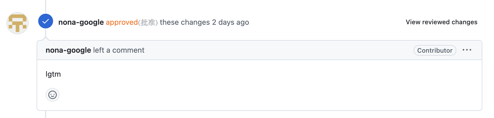

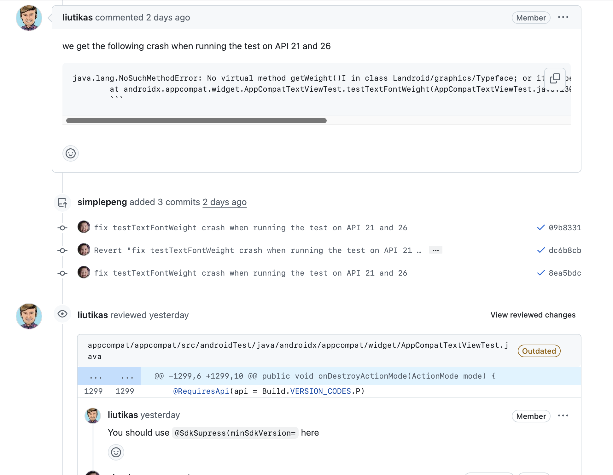

总的来说，这次给`androidx`提交代码还是很开心，因为`AOSP`里面也有我写的代码啦，哈哈哈~ 从`readme`得知，`github`上这个`androidx`仓库只是`AOSP`里面的`androidx`一个镜像，在github上合并的pr都会同步到`AOSP`里面去。

好了这篇文章就到这里结束了~假的，我骗你的。因为我在看`androidx`里面源码的时候，发现了一个神奇的类，那就是`TypefaceCompat`。它里面有个`create`的方法，可以适配不同的系统版本，创建带有`weight`的`Typeface`。

```java
public static Typeface create(@NonNull Context context, @Nullable Typeface family,
        @IntRange(from = 1, to = 1000) int weight, boolean italic) {
    if (context == null) {
        throw new IllegalArgumentException("Context cannot be null");
    }
    Preconditions.checkArgumentInRange(weight, 1, 1000, "weight");
    if (family == null) {
        family = Typeface.DEFAULT;
    }
    return sTypefaceCompatImpl.createWeightStyle(context, family, weight, italic);
}
```

在这个类初始化的时候，`static`代码块里面会创建自适应的`sTypefaceCompatImpl`。

```java
static {
    if (Build.VERSION.SDK_INT >= 29) {
        sTypefaceCompatImpl = new TypefaceCompatApi29Impl();
    } else if (Build.VERSION.SDK_INT >= 28) {
        sTypefaceCompatImpl = new TypefaceCompatApi28Impl();
    } else if (Build.VERSION.SDK_INT >= Build.VERSION_CODES.O) {
        sTypefaceCompatImpl = new TypefaceCompatApi26Impl();
    } else if (Build.VERSION.SDK_INT >= Build.VERSION_CODES.N
            && TypefaceCompatApi24Impl.isUsable()) {
        sTypefaceCompatImpl = new TypefaceCompatApi24Impl();
    } else if (Build.VERSION.SDK_INT >= Build.VERSION_CODES.LOLLIPOP) {
        sTypefaceCompatImpl = new TypefaceCompatApi21Impl();
    } else {
        sTypefaceCompatImpl = new TypefaceCompatBaseImpl();
    }
}
```

本来我是打算再提交个pr，让`AppcompatTextView`能不区分版本的支持`textFontWeight`，但是在自己写代码的时候好像发现为啥Google的大佬不这样做的原因了，可能是因为`Typeface.getWeight`这个方法是在`Api28`添加的，这样就不好写单元测试了。其实要做感觉也能做，就是给`AppcompatTextView`增加`getWeight`的方法，但是这样又感觉有点抽象😂。

所以就此，我又搞了一个新的仓库😄，用来适配全版本的`textFontWeight`。

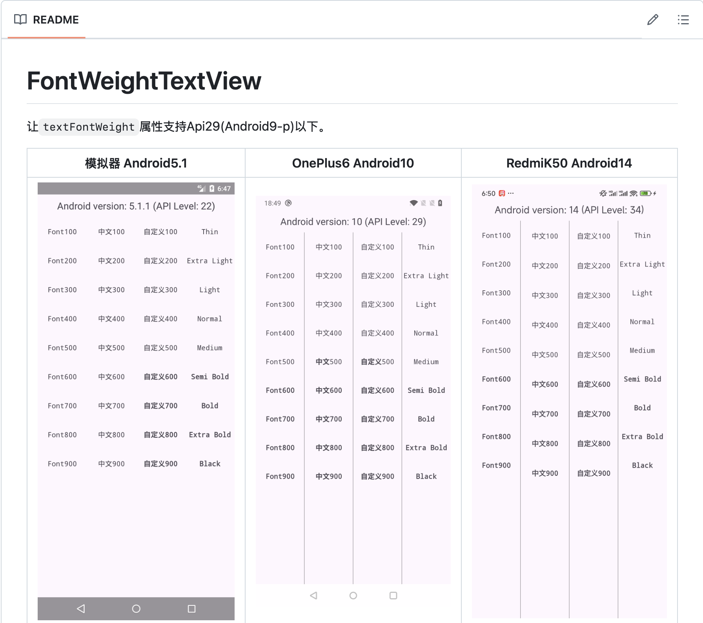

[simplepeng/FontWeightTextView: 让textFontWeight属性支持Api29(Android9-p)以下 ](https://github.com/simplepeng/FontWeightTextView)

代码确实很简单，就读取了下`textFontWeight`的属性，然后调用了下`TypefaceCompat.create`，以至于群里老哥都吐槽：就这么几行代码还要搞一个库😂？

就此，本篇文章确实结束啦，完结撒花✿✿ヽ(°▽°)ノ✿。
