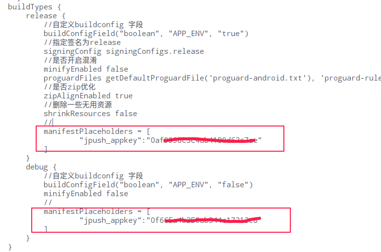

# ManifestPlaceholders的妙用

开发中很多时候我们会遇到这种场景，比如说：在用到一个第三方sdk，但是这个sdk并没有区分开发环境和线上环境，这时候我们就可能会申请两个不同的key标识，而且很多key标识都只能在androidmanifest里面配置。所以每次上线生成apk就必须手动去更改key标识，如果渠道版本少也还好，打包速度快也还行，需要区分环境的的key标识相对较少也还不错 ，但是如果你一项都沾不到边，到时忘记哪个key忘记替换了，一定会有种“身体被掏空的赶脚”，别问我为什么知道，感觉身体被掏空！！！

先在androidmanifest文件配置一个节点，这里以极光为例

```xml
<meta-data
    android:name="JPUSH_APPKEY"
    android:value="${jpush_appkey}"/>
    
```

再看看build.gradle里面怎么写



在bulidtypes节点下有release节点和debug节点，正式签名时就会走release节点的下编译脚本，调试签名时就会走debug节点。
本文主要点就是红框标记的manifestPlaceholders的用法，jpush_appkey对应的就是之前在androidmanifest文件配置的${jpush_appkey}的这个值。

点进源码我们可以发现manifestPlaceholders接收是一个Map的参数，所以这样其实还有很多可以自定义的地方。


比如说在多渠道打包我们也用到了manifestPlaceholders，androidstudio多渠道打包方式网上教程已经很多了，
这里就不多说了，具体内容可以google或者bing，百度就不推荐，以免被坑，嘿嘿嘿。


我们在程序入口出打上log，用来输出key的值

```java
  
        String jpush_appkey;
        try {
            ApplicationInfo appInfo = getPackageManager()
                    .getApplicationInfo(getPackageName(),
                            PackageManager.GET_META_DATA);
            
            jpush_appkey = appInfo.metaData.getString("JPUSH_APPKEY");
            
            Logger.d("jpush_appkey=" + jpush_appkey);
        } catch (PackageManager.NameNotFoundException e) {
            e.printStackTrace();
          
        }
```

正式环境的key值


测试环境的key值


可以看到这个和之前我们在build.gradle只配置的一样的。

## 总结
manifestPlaceholders 可以替换androidmanifest文件中的标签，可作为快速渠道打包替换渠道名的一种方式，也可以自定义标签用来替换需要的文本，多作为不同环境不同key的修改。
