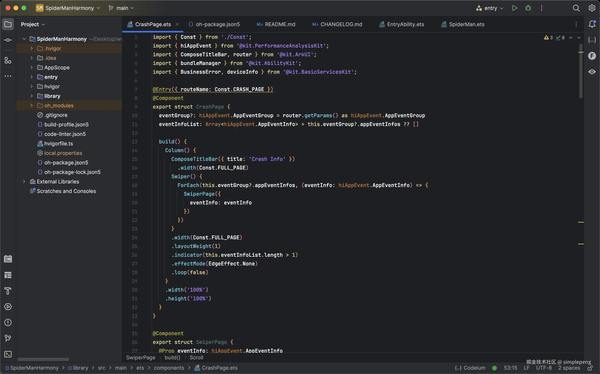
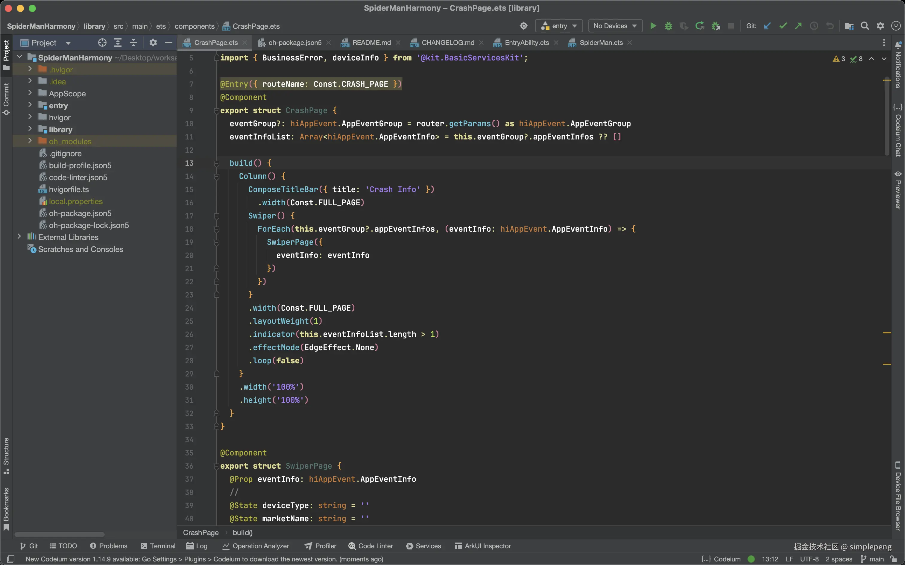
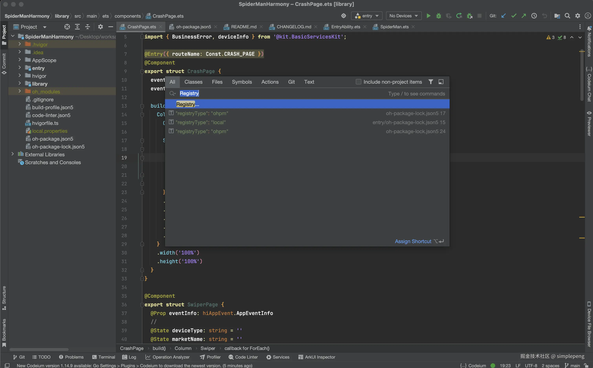
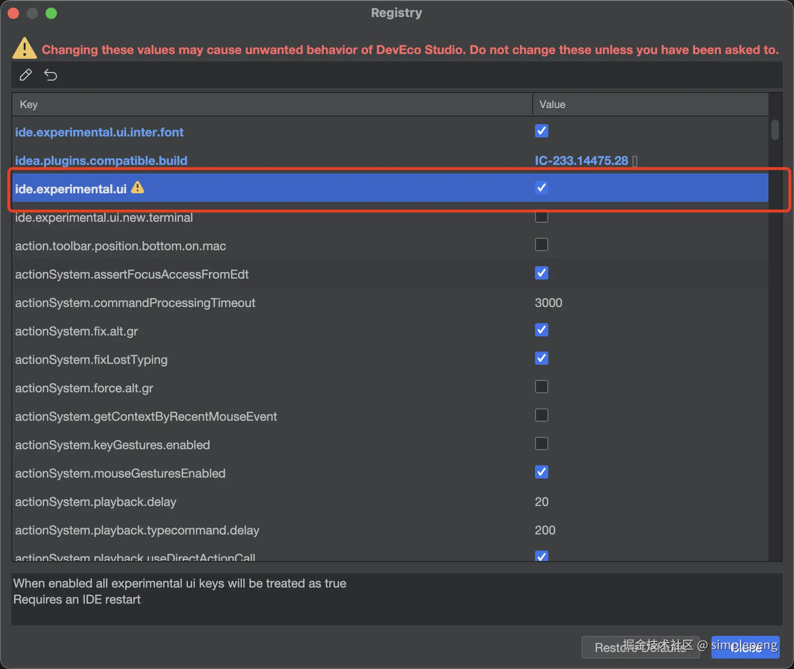

# 鸿蒙Next DevEco Studio开启NewUI

众所周知，DevEco也是基于Jetbrain的IntelliJ IDEA社区版开发，所以原则上也是可以开启NewUI的。

开了NewUI的样子：

没开NewUI的样子：

从我的审美来说，我还是比较喜欢开了NewUI的样子😁。

双击`shift`打开搜索窗口，输入`Registry`，然后打开。接着打开`experimental`属性中的`ui`部分就可以了，最后只需要重启，你就能愉快的写代码🌶。

