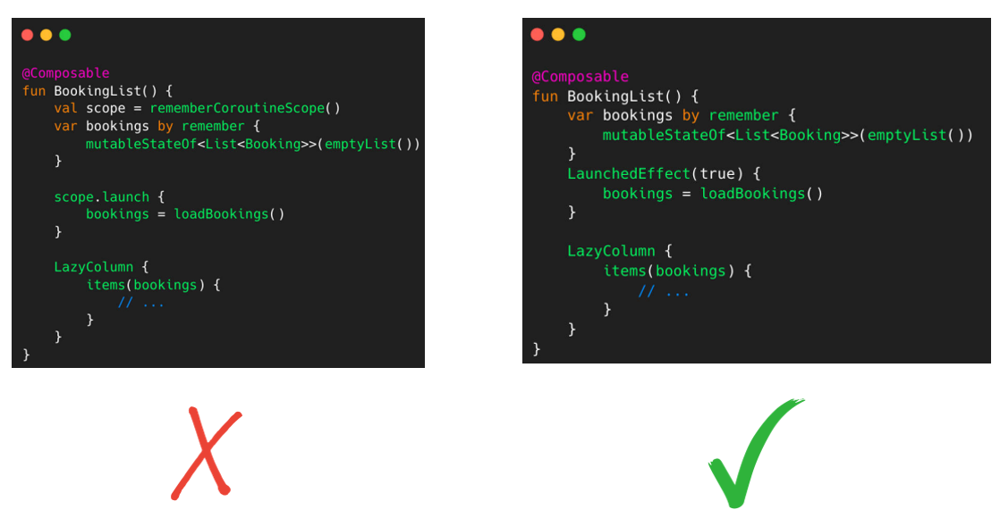
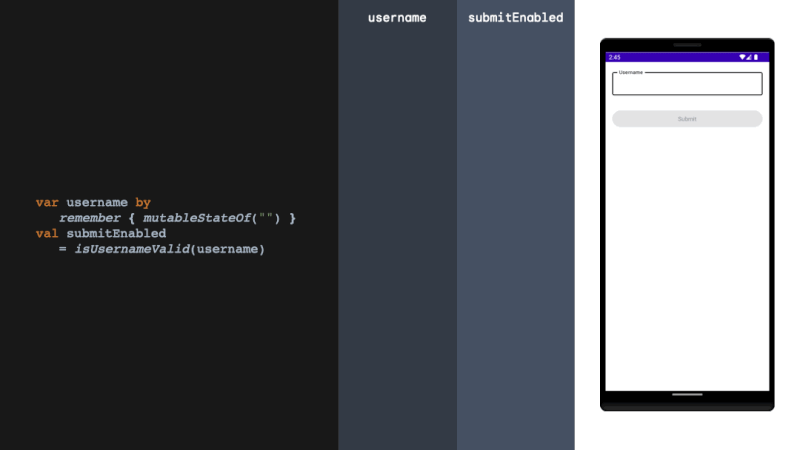
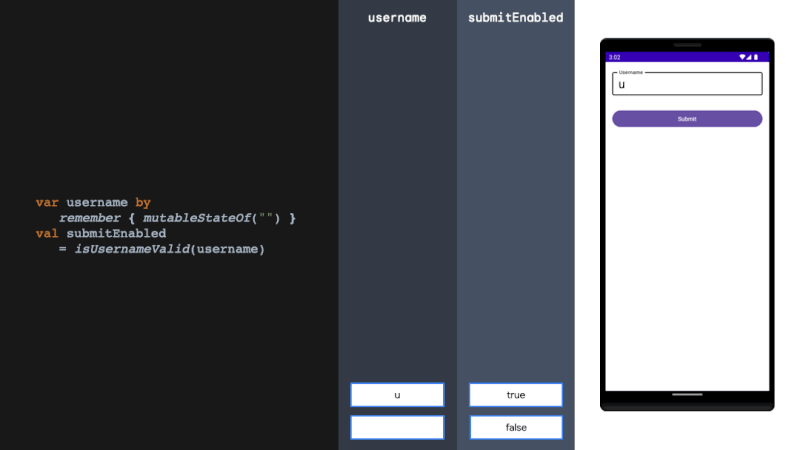
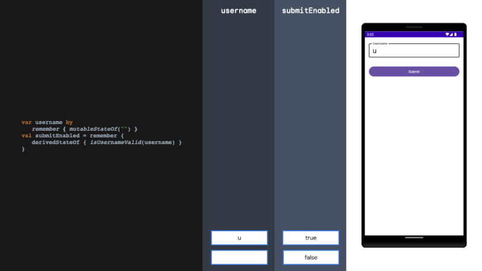

# Jetpack Compose Side Effects in Details  副作用的详细信息

## **What is Side Effect’s? 副作用是什么？**

Side Effects is a change in the state of the application that occurs outside the scope of the composable function and is not related to the UI. In non-UI related state changes, our screen may recompose more than necessary. This causes performance loss in our application.  
副作用是指在可组合函数范围之外发生的应用程序状态更改，并且与 UI 无关。在非 UI 相关的状态更改中，我们的屏幕可能会进行不必要的重组。这会导致我们的应用程序性能下降。

-   API request as a result of the user clicking the button.  
    用户单击按钮后产生的 API 请求。
-   Database operations in the application.  
    应用程序中的数据库操作。

## LaunchedEffect

LaunchedEffect, takes two arguments, key for representing when should it be executed and block to declare the lambda function. Whenever the key value changes, this lambda is triggered and the functions in scope are executed. If the key is not defined, then it gets executed only when the initial composition occurs and updates the UI.  
LaunchedEffect 接受两个参数，key 用于表示何时执行，以及 block 来声明 lambda 函数。每当键值发生变化时，就会触发此 lambda 并执行作用域中的函数。如果未定义该键，则仅在初始组合发生并更新 UI 时执行它。

The most important feature of Launched Effect is that it can work with asynchronous processes and initialise Coroutines.  
Launched Effect 最重要的特点是它可以与异步进程一起工作并初始化协程。

```kotlin
@Composable
fun Header() {
    var launchEffectState by remember { mutableStateOf(true) }
    var defaultState by remember { mutableStateOf(true) }
    val context = LocalContext.current

    LaunchedEffect(key1 = launchEffectState) {
        Toast.makeText(context, "Launch Effect State Tetiklendi!", Toast.LENGTH_LONG).show()
    }

    Toast.makeText(LocalContext.current, "Default State Tetiklendi!", Toast.LENGTH_LONG).show()

    Column(
        modifier = Modifier.fillMaxSize(),
        horizontalAlignment=Alignment.CenterHorizontally,
        verticalArrangement = Arrangement.Center
    ) {
        Text(
            modifier = Modifier.clickable { launchEffectState = !launchEffectState },
            text = "Launch Effect State: $launchEffectState",
            fontSize = 32.sp
        )
        Spacer(modifier = Modifier.height(16.dp))
        Text(
            modifier = Modifier.clickable { defaultState = !defaultState },
            text = "Default state: $defaultState",
            fontSize = 32.sp
        )
    }
}
```

## DisposableEffect

The Disposable Effect is triggered when the composable function is first created, then used to release the resource it uses when the composable is removed from the screen.  
Disposable Effect 在首次创建可组合函数时触发，然后用于在可组合函数从屏幕上移除时释放其使用的资源。

**Disposable Effect Block:** This block defines the operations in DisposableEffect. This is typically when the Composable is initially displayed or when its parent Composable is initially composed. It is usually used to initialise a resource or start another interaction.  
**Disposable Effect 块：**该块定义了 DisposableEffect 中的操作。这通常是在可组合项最初显示时或其父可组合项最初组合时。它通常用于初始化资源或启动另一个交互。

**OnDispose Block:** The code inside the onDispose block is executed when the Composable is removed from the composition. In this block, operations such as cleaning or deactivating resources are executed.  
**OnDispose 块：**当从组合中删除可组合项时，将执行 onDispose 块内的代码。在该块中，执行清理或停用资源等操作。

```kotlin
@Composable
fun TimerScreen() {
    val elapsedDuration = remember { mutableStateOf(0) }
    DisposableEffect(Unit) {

        val scope = CoroutineScope(Dispatchers.Default)

        val job = scope.launch {
            while (true) {
                delay(1000)
                elapsedDuration.value += 1
                println("The timer is still running ${elapsedDuration.value}")
            }
        }

        onDispose {
            //job.cancel()
            println("Timer cancelled ${elapsedDuration.value}")
        }
    }

    Text(
        text = "Geçen Süre: ${elapsedDuration.value}",
        modifier = Modifier.padding(16.dp),
        fontSize = 24.sp
    )
}

@Composable
fun RunTimerScreen() {
    val isVisible = remember { mutableStateOf(true) }

    Column(
        horizontalAlignment = Alignment.CenterHorizontally,
        verticalArrangement = Arrangement.Center
    ) {
        Spacer(modifier = Modifier.height(10.dp))

        if (isVisible.value)
            TimerScreen()

        Button(onClick = { isVisible.value = false }) {
            Text("Hide Timer")
        }
    }
}
```

## rememberCoroutineScope

Composable is used to start the coroutine as a result of a trigger in the function. For example, it is used in cases such as making a network request as a result of the user clicking a button. This is particularly useful when you need to launch and manage coroutines within Jetpack Compose components, ensuring that they are canceled appropriately when the Composable is removed from the UI hierarchy.  
可组合用于在函数中触发时启动协程。例如，它用于诸如由于用户单击按钮而发出网络请求的情况。当您需要在 Jetpack Compose 组件中启动和管理协程时，这特别有用，确保在从 UI 层次结构中删除 Composable 时适当地取消它们。

```kotlin
@Composable
fun Header(scope: CoroutineScope) {
    var state by remember { mutableStateOf(true) }
    val context = LocalContext.current

    Column(
        modifier = Modifier.fillMaxSize(),
        horizontalAlignment = Alignment.CenterHorizontally,
        verticalArrangement = Arrangement.Center
    ) {
        Text(
            modifier = Modifier.clickable {
                scope.launch {
                    delay(3000)
                    Toast.makeText(context, "Hello world $state", Toast.LENGTH_LONG).show()
                }
            },
            text = "Hello world $state",
            fontSize = 32.sp
        )
        Spacer(modifier = Modifier.height(16.dp))
        Text(
            modifier = Modifier.clickable {
                state = !state
            },
            text = "Hello amigo $state",
            fontSize = 32.sp
        )
    }
}
```

**rememberCoroutineScope vs LaunchedEffect**

**LaunchedEffect** should be used when you want that some action must be taken when your composable is first launched/relaunched (or when the key parameter has changed).  
当您希望在首次启动/重新启动可组合项时（或当关键参数发生更改时）必须执行某些操作时，应使用**LaunchedEffect** 。  
**rememberCoroutineScope** on the other hand, is specific to store the Coroutine scope allowing the code to launch some suspend function.  
另一方面， **rememberCoroutineScope** 专门用于存储 Coroutine scope，允许代码启动某些挂起函数。



The example above shows the code blocks that display a list of type Booking. When remembercoroutinescope is used in the example on the left, a new network request will be made every time the screen is recomposed. In the Launched Effect example on the right, the recomposition is not affected by the recomposition status and the request will be made only when the screen is loaded for the first time.  
上面的示例展示了显示 Booking 类型列表的代码块。当左侧示例中使用remembercoroutinescope时，每次界面重组时都会发出新的网络请求。在右侧的 Launched Effect 示例中，重组不受重组状态的影响，仅在第一次加载屏幕时才会发出请求。

## SideEffect

Just like in Luanch Effect, we write the codes that we do not want to run in every recompose under the Side Effect scope. The most important difference from Launch Effect is that Side Effect does not work with coroutine.  
就像在 Luanch Effect 中一样，我们在 Side Effect 范围内编写了不想在每次重构中运行的代码。与 Launch Effect 最重要的区别是 Side Effect 不能与协程一起使用。

```kotlin
@Composable
fun WithOutSideEffectExample() {
    val count = remember { mutableStateOf(0) }

    SideEffect {
        println("Count is ${count.value}")
    }
    Button(onClick = { count.value++ }) {
        Text(text = "Click here!")
    }
}
```

## derivedStateOf

derivedStateOf should be used when your state or key changes more than you want to update your UI. We solve this problem by filtering between derivedStateOf scopes. It can be extremely effective in minimising recomposition.  
当您的状态或键更改超过您想要更新 UI 的程度时，应使用 derivedStateOf。我们通过在衍生状态范围之间进行过滤来解决这个问题。它可以非常有效地减少重组。







## rememberUpdatedState

The rememberUpdatedState is a side effect handler provided by Jetpack Compose that is used to ensure that a Composable always reflects the most up-to-date state when it’s recomposed. It’s particularly useful when you need to work with a snapshot of some state that might change during the composition process.  
rememberUpdatedState 是 Jetpack Compose 提供的副作用处理程序，用于确保 Composable 在重构时始终反映最新状态。当您需要处理在合成过程中可能发生变化的某些状态的快照时，它特别有用。

```kotlin
@Composable
fun Header() {
    var caller by remember { mutableStateOf("Default") }
    Column(
        horizontalAlignment = Alignment.CenterHorizontally,
        verticalArrangement = Arrangement.Center
    ) {
        Text(
            modifier = Modifier.clickable { caller = "First Text" },
            text = "Clicked, $caller",
            color= Color.Black,
            fontSize = 32.sp
        )
        Text(
            modifier = Modifier.clickable { caller = "Second Text" },
            text = "Clicked, $caller",
            color= Color.Blue,
            fontSize = 32.sp
        )
        CallTimer(caller)
    }
}
@Composable
fun CallTimer(caller: String) {
    println("Composable: $caller")
    val updated by rememberUpdatedState(newValue =caller )
    LaunchedEffect(key1 = Unit) {
        delay(7000)
        println("LaunchedEffect: $caller")
    }
}
```

## produceState

produceState is a simple concept that combines the functionality of remember and LaunchedEffect. It creates a state variable and then updates the value of the state variable based on the results of a side effect. This can be used to ensure that your composables are always displaying the latest data.  
ProduceState 是一个简单的概念，结合了 Remember 和 LaunchedEffect 的功能。它创建一个状态变量，然后根据副作用的结果更新状态变量的值。这可用于确保您的可组合项始终显示最新数据。

The produce state composable takes **initialValue** and **producer**. InitialValue is the initial value of the state variable. Producer is a lambda that defines the side effect that will be executed to update the value of the state variable. This lambda will be executed when the produce state composable is first composed, and it will be executed again whenever the value of the state variable changes.  
生产状态可组合项采用**初始值**和**生产者**。 InitialValue 是状态变量的初始值。 Producer 是一个 lambda，它定义将执行以更新状态变量值的副作用。该 lambda 将在第一次组合生成状态可组合项时执行，并且每当状态变量的值发生变化时都会再次执行。

```kotlin
@Composable
fun MyComposition() {

    var isLoading: Boolean by remember { mutableStateOf(true)}

    val data: String by produceState(initialValue = "") {
        value = getData()
        isLoading = false
    }

    Column(
        horizontalAlignment = Alignment.CenterHorizontally,
        verticalArrangement = Arrangement.Center
    ) {
        if (isLoading) {
            CircularProgressIndicator()
        } else {
            Text(text = data)
        }
    }
}

suspend fun getData(): String {
    delay(4000) // simulate a long-running operation
    return "Data loaded from a data source"
}
```

[Jetpack Compose Side Effects in Details | by Nasuh Ünal | Sep, 2024 | Medium](https://medium.com/@nasuhunal1/side-effects-in-jetpack-compose-31f495f48b4e)